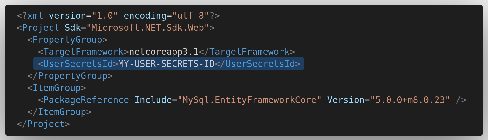
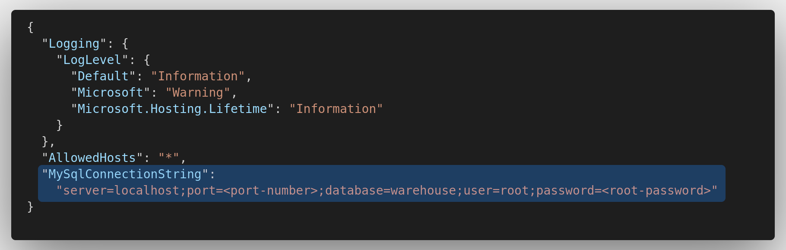

# Warehouse Manager

### ***THIS PROJECT IS UNDER DEVELOPMENT***

This project is intended to be used to manage bulk ore stocks using MySql database through a web server running on a LAN.  
I'll try to design the application so that it can be used as well as a simple general purpose warehouse manager with a few modifications.

This project provides functionalities for a companie that stocks, processes and transports bulk ore owned by third parties and must register informations related to the incomings, shippings, processing and balance of the products of each client, tax data as well as other informations related to the transportation like vehicles and drivers.

## 1. Development Environment

- **IDE:** Visual Studio Code
- **OS:** Debian 11 (Bullseye)
- **Programming Language:** C#
- **Front-End:** HTML, Bootstrap CSS, Razor Views
- **Framework:** .NET Core 3.1
- **Database:** MySql 8.0
- **Web Server:** NGINX 1.19

## 2. Features

The application should meet the following critirias:

1. Only registered users should access the application and restrictions are applied according to their roles.
2. Register and manipulate the following records:

- Users
- Clients
- Products
- Stocks
- Vehicles
- Drivers
- Incomings
- Shippings
- Product Enhancements

3. Provide a friendly user interface to collect and display informations stored in the DB.
4. Provide well-structured reports of activities and stocks.

**Further improvements:**

- Dockerize the project.
- Design a mobile front-end interface.
- Implement an SPA interface using the React framework.

## 3. Configuring and running

Following is how to configure and run MySql Server, NGINX and the application.  

### 3.1 .NET SDK

Before install the .NET SDK, configure the Microsoft repository with the following commands:

```
wget https://packages.microsoft.com/config/debian/10/packages-microsoft-prod.deb -O packages-microsoft-prod.deb
sudo dpkg -i packages-microsoft-prod.deb
sudo apt-get update
```

This project uses *.NET Core 3.1*. Install the SDK with the following commands:

```
sudo apt-get install -y apt-transport-https
sudo apt-get install -y dotnet-sdk-3.1
```

You can find more information about installation on other linux distributions at [Microsoft Docs](https://docs.microsoft.com/en-us/dotnet/core/install/linux).

### 3.2 NGINX server

*(To do.)*

During development, NGINX server is not necessary to run the application.  
<span>ASP.</span>NET Core framework provides the kestrel built-in server which has all the basics to handle requests and run in the localhost.

### 3.3 MySql Docker

Install *Docker* if you haven't yet.  
Configure and run a MySql container for the first time with the following command:

```
docker run --name <container-name> -p<port-number>:3306 -v <volume-name>:/var/lib/mysql -e MYSQL_ROOT_PASSWORD=<root-password> -d mysql
```

Argument | Description
---------|------------
container&#8209;name | The name you want to use for the container.
port&#8209;number | The number of the port to be used on the host. This port will be used to configure the connection string for MySql server in the project configuration. Standard is `3306`.
volume&#8209;name | The name of a Docker volume to persit database data. A volume can be created with the command: `docker volume create <volume-name>`.
root&#8209;password | The password for the root user on the database.

The `mysql` argument chooses the latest version of MySql. If you need a specific version, change this argument.  
This will create and run MySql server with docker. Subsequent calls to start and stop the container can be done with

```
docker start <container-name>
```

and

```
docker stop <container-name>
```

See [Docs Docker](https://docs.docker.com/) for more information about Docker and its installation.  
For more information about MySql Docker, see [Mysql Docker Page](https://hub.docker.com/_/mysql).

### 3.4 Connection string

To connect with the MySql docker server you need to configure the connection string in the source code.  

***Attention!***  
This project is using *.NET Secret Manager tool* to store connection string data. You should change the code to use your own connection string.  
**Remove the UserSecretsId tag from the .csproj file.**  


#### 3.4.1 Using .NET Secrets Manager tool

Use the **dotnet cli** to initialize your secret storage and configure the project.  
Run the following command in the project directory:

```
dotnet user-secrets init
```

This command will create a user secrets id and insert it in the project's .csproj file.  
Then, run the following command in the project directory to create the connection string:

```
dotnet user-secrets set "MySqlConnectionString":"server=localhost;port=<port-number>;database=warehouse;user=root;password=<root-password>"
```

`<port-number>` and `<root-password>` should be the values used to create the MySql container.

#### 3.4.2 Using *appsettings.json* file

Edit the *appsettings.json* file in the project directory to insert the connection string with the data you used to create the MySql container.  
Add the following line:  


### 3.5 Build and run the application

To build the project, you need to add the MySql.EntityFrameworkCore package. Run the following command in the project directory:

```
dotnet add package MySql.EntityFrameworkCore --version 5.0.0+m8.0.23
```

To build and run using **Visual Studio Code** press the `Ctrl + F5` key combination to run *whitout* debug or `F5` to run *with* debug.

To build and run using **dotnet cli**, use the following commands:

```
dotnet build
```

and 

```
dotnet run
```

You should be presented with the following output if everything is working:  


See [MySql Connector/NET for Entity Framework](https://dev.mysql.com/doc/connector-net/en/connector-net-entity-framework.html) for more information.

### 3.6 Known Issues

#### 3.6.1 Dependencies Issues

- Visual Studio Code may report problems related to dependecies issues with **Microsoft.EntityFrameworkCore** package.  
  Try to run the following command in the project directory:

```
dotnet restore
```

## 4. Contributing

Pull requests are welcome. Feel free to open an issue to discuss what could be improved.

## 5. License

This project is made available under the ***[GNU GPLv3 License](./LICENSE)***.
